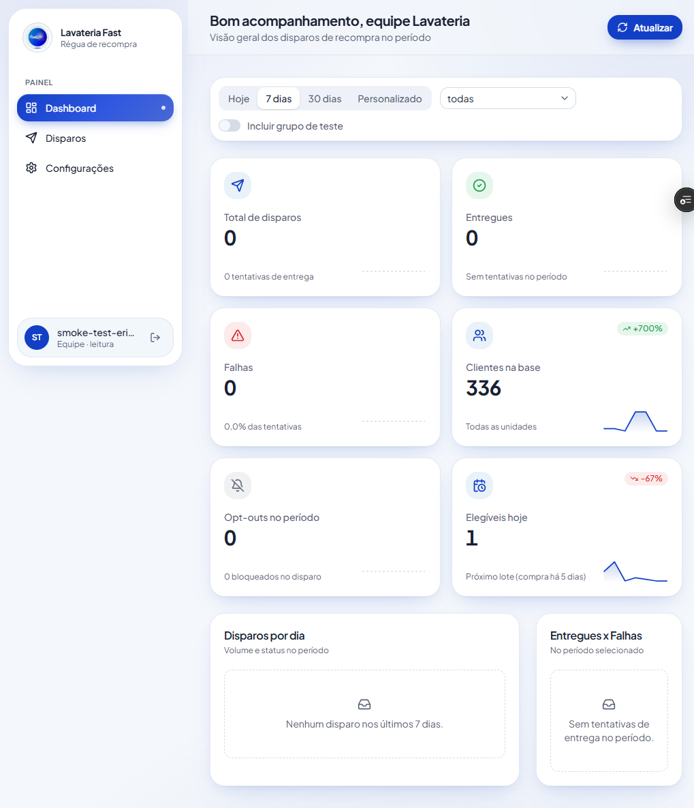
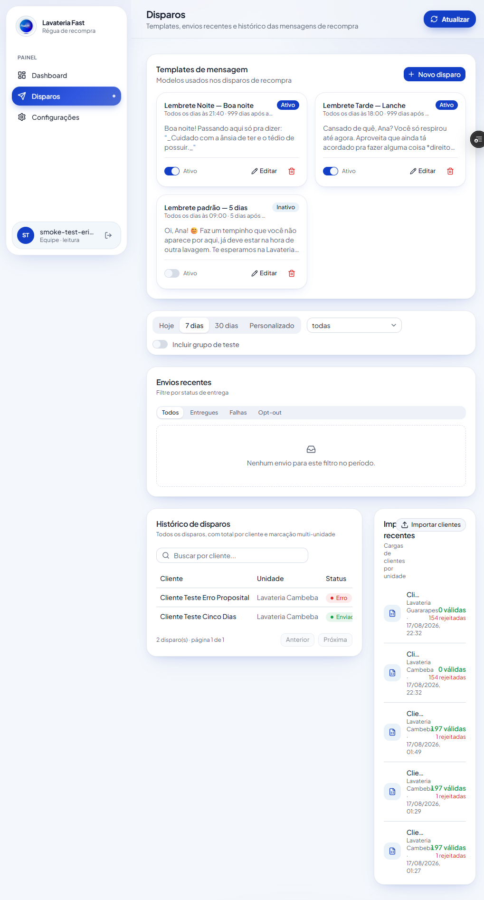
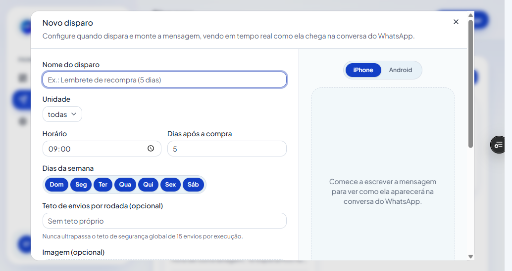
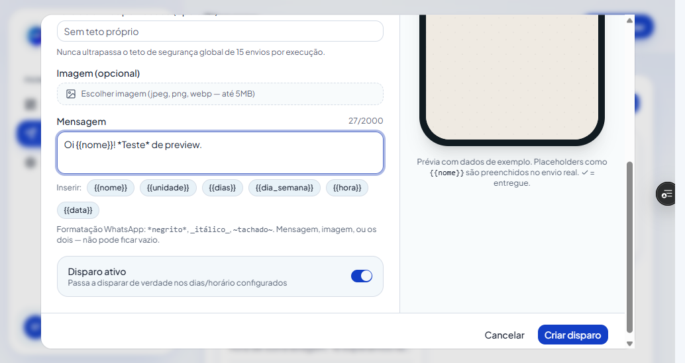
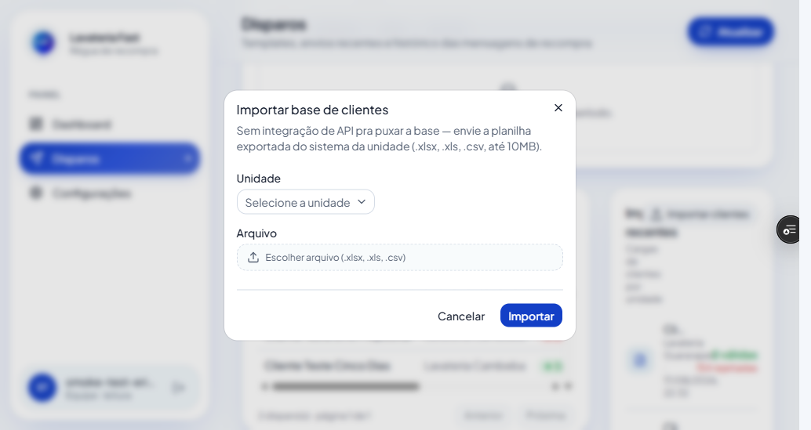
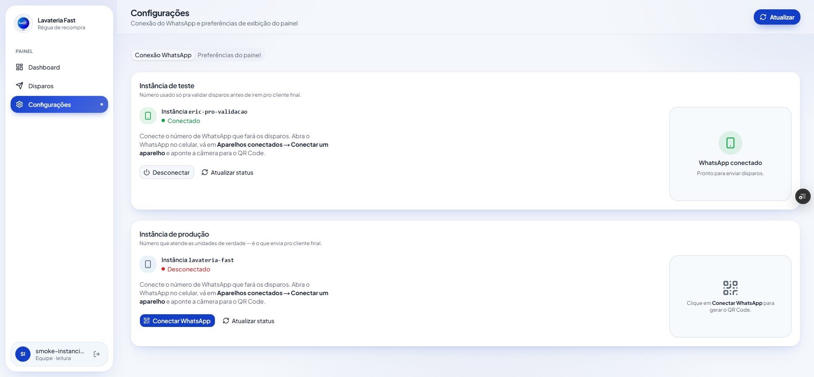
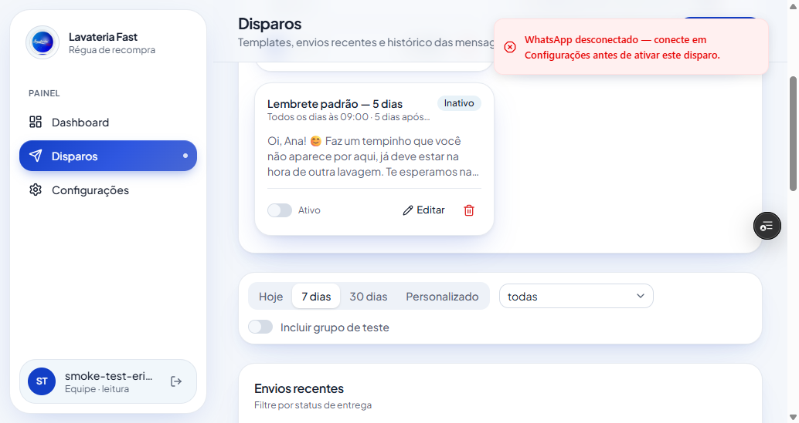

<div align="center">

# Painel de Disparos — Lavateria Fast

**Régua de recompra via WhatsApp: acompanhamento, templates e conexão do número — tudo em um painel.**

Monitora os lembretes enviados alguns dias após a última compra do cliente, para as unidades **Cambeba** e **Guararapes**.

[](https://nextjs.org)
[](https://react.dev)
[](https://www.typescriptlang.org)
[](https://tailwindcss.com)
[](https://supabase.com)
[](https://vercel.com)

</div>

---

## Índice

- [Sobre](#sobre)
- [Capturas de tela](#capturas-de-tela)
- [Funcionalidades](#funcionalidades)
- [Stack](#stack)
- [Arquitetura](#arquitetura)
- [Começando](#começando)
  - [Pré-requisitos](#pré-requisitos)
  - [Instalação](#instalação)
  - [Variáveis de ambiente](#variáveis-de-ambiente)
  - [Rodando localmente](#rodando-localmente)
- [Estrutura do projeto](#estrutura-do-projeto)
- [Scripts](#scripts)
- [Deploy](#deploy)
- [Segurança](#segurança)
- [Licença](#licença)

---

## Sobre

Este é o **frontend operacional** da régua de recompra da Lavateria Fast. Ele **não envia** as mensagens — o envio real roda em Edge Functions no backend (repositório `lavateria-whatsapp-reminder`), acionadas por agendamento e integradas à [Evolution API](https://doc.evolution-api.com/). Este painel é a camada onde a equipe:

- acompanha o que foi enviado, entregue e falhou;
- monta e ativa os **disparos** (templates de mensagem + regra de quando disparar);
- conecta os números de WhatsApp (instâncias de **teste** e **produção**);
- importa a base de clientes exportada do sistema de cada unidade.

O acesso é **restrito à equipe** e o painel é majoritariamente **somente leitura** — a exceção são os disparos e a conexão do WhatsApp.

## Capturas de tela

### Dashboard

KPIs do período: total de disparos, entregues, falhas, opt-outs, clientes na base e elegíveis para o próximo lote.



### Disparos

Templates de mensagem, envios recentes e histórico por cliente com marcação multi-unidade.



### Novo disparo

Unidade, horário, dias após a compra, dias da semana e teto de envios por rodada.



### Prévia do WhatsApp

A mensagem renderizada em tempo real, como chega na conversa (iPhone/Android).



### Importar clientes

Upload da planilha exportada do sistema da unidade (`.xlsx`, `.xls`, `.csv`, até 10 MB).



### Conexão do WhatsApp

Pareamento por QR Code e status das instâncias de teste e produção, geridas separadamente.



### Guard de ativação

Um disparo não pode ser ativado com o WhatsApp de produção desconectado.



## Funcionalidades

- **Dashboard** — KPIs por período (hoje / 7 dias / 30 dias / personalizado) e por unidade: total de disparos, entregues, falhas, opt-outs, clientes na base e elegíveis para o próximo lote. Gráficos de disparos por dia e entregues × falhas. Opção de incluir/excluir o grupo de teste.
- **Disparos** — CRUD dos templates de mensagem (nome, unidade, horário, dias após a compra, dias da semana, teto de envios por rodada, imagem opcional) com **prévia em tempo real** de como a mensagem chega no WhatsApp. Placeholders suportados: `{{nome}}`, `{{unidade}}`, `{{dias}}`, `{{dia_semana}}`, `{{hora}}`, `{{data}}`.
- **Guard de ativação** — impede ativar um disparo se a instância de produção do WhatsApp não estiver conectada, evitando o cenário "parece que está rodando e nada sai".
- **Envios recentes e histórico** — tabela filtrável por status (entregues / falhas / opt-out), com busca por cliente, total de disparos por cliente e marcação multi-unidade.
- **Importação de clientes** — envio da planilha exportada do sistema da unidade; o painel apenas faz proxy para a Edge Function que valida, normaliza telefone e grava. Histórico de cargas com linhas válidas/rejeitadas.
- **Conexão do WhatsApp** — pareamento por QR Code e status das instâncias de **teste** e **produção**, geridas separadamente.
- **Exportação CSV** dos dados do período.
- **Autenticação** via Supabase Auth, com proteção de rota no middleware e rate limit nos endpoints sensíveis (login e APIs internas).

## Stack

| Camada        | Tecnologia                                                              |
| ------------- | ---------------------------------------------------------------------- |
| Framework     | [Next.js 16](https://nextjs.org) (App Router, Server Components/Actions) |
| UI            | React 19, [Tailwind CSS 4](https://tailwindcss.com), [shadcn/ui](https://ui.shadcn.com) + [Base UI](https://base-ui.com), [lucide-react](https://lucide.dev) |
| Dados/estado  | [SWR](https://swr.vercel.app), [Recharts](https://recharts.org)          |
| Editor        | [Tiptap](https://tiptap.dev)                                            |
| Backend       | [Supabase](https://supabase.com) (Postgres, Auth, Storage, Edge Functions) |
| Mensageria    | [Evolution API](https://doc.evolution-api.com/) (via backend)            |
| Observabilidade | [Vercel Analytics](https://vercel.com/analytics), [Sonner](https://sonner.emilkowal.ski) (toasts) |
| Hospedagem    | [Vercel](https://vercel.com)                                            |

## Arquitetura

```
                       ┌──────────────────────────────┐
   equipe  ───────────▶│  Painel (este repositório)   │
   (browser)           │  Next.js @ Vercel            │
                       │                              │
                       │  • Server Components / SWR   │
                       │  • Server Actions (disparos) │
                       │  • Route Handlers (proxy)    │
                       └───────┬───────────┬──────────┘
                     service_role│         │x-trigger-secret / API key
                                 ▼         ▼
                 ┌───────────────────┐  ┌─────────────────────────────┐
                 │  Supabase         │  │  Edge Functions (backend)   │
                 │  Postgres + Auth  │  │  importar-clientes          │
                 │  + Storage        │  │  disparo-diario ─▶ Evolution│
                 └───────────────────┘  └─────────────────────────────┘
```

- **Leitura do painel** usa `service_role` no servidor. As tabelas sensíveis (`clientes`, `envios`, `unidades`, `importacoes`, `disparos_agendados`) têm RLS habilitado **sem policies** (deny-all): PII como CPF e telefone nunca sai pela chave `anon` no browser.
- **Escrita** (CRUD de disparos, upload de imagem) acontece só em Server Actions / Route Handlers.
- **Importação** e **envio** ficam no backend; o painel apenas encaminha a requisição com um segredo de baixo privilégio.
- As credenciais da Evolution API e o `service_role` **nunca** entram no bundle do cliente — só as rotas `app/api/*` server-side as usam.

## Começando

### Pré-requisitos

- **Node.js 20+**
- **pnpm 10+** (`corepack enable`)
- Acesso ao projeto **Supabase** e às credenciais da **Evolution API** (peça ao time)

### Instalação

```bash
git clone git@github.com:Ericsilvaa/drip-watch-vn.git
cd drip-watch-vn
pnpm install
```

### Variáveis de ambiente

Copie o exemplo e preencha os valores:

```bash
cp .env.example .env.local
```

| Variável                          | Onde entra                         | Descrição                                                                 |
| --------------------------------- | ---------------------------------- | ----------------------------------------------------------------------- |
| `NEXT_PUBLIC_SUPABASE_URL`        | browser + servidor                 | URL do projeto Supabase                                                  |
| `NEXT_PUBLIC_SUPABASE_PUBLISHABLE_KEY` | browser + servidor            | Chave `anon`/publishable (pode ser pública — RLS restringe o acesso)     |
| `SUPABASE_SERVICE_ROLE_KEY`       | **só servidor**                    | Chave `service_role`. **Nunca** prefixar com `NEXT_PUBLIC_`              |
| `SUPABASE_FUNCTIONS_URL`          | só servidor                        | Base das Edge Functions (`.../functions/v1`)                             |
| `IMPORT_TRIGGER_SECRET`           | só servidor                        | Segredo de baixo privilégio para acionar `importar-clientes`             |
| `EVOLUTION_API_URL`               | só servidor                        | Base da Evolution API                                                    |
| `EVOLUTION_API_KEY`               | só servidor                        | API key da Evolution API                                                 |
| `EVOLUTION_INSTANCE_TESTE`        | só servidor                        | `instanceName` da instância de teste                                     |
| `EVOLUTION_INSTANCE_PRODUCAO`     | só servidor                        | `instanceName` da instância de produção (tem que bater com a Evolution)  |
| `EVOLUTION_GUARD_ATIVACAO`        | só servidor (opcional)             | Só para validar o guard contra a instância de teste. Deixe vazio em produção — o padrão é `producao` |

> Todas as variáveis sem o prefixo `NEXT_PUBLIC_` são server-only e não podem chegar ao browser. Detalhes e o "porquê" de cada uma estão comentados em [`.env.example`](.env.example).

### Rodando localmente

```bash
pnpm dev
```

Abra <http://localhost:3000>. Sem sessão, você é redirecionado para `/auth/login`.

## Estrutura do projeto

```
app/
  page.tsx                 Dashboard (rota /)
  disparos/                Templates, envios recentes e histórico
  configuracoes/           Conexão do WhatsApp + preferências do painel
  auth/                    Login e callback (Supabase Auth)
  templates/actions.ts     Server Actions: CRUD de disparos + guard de ativação
  api/
    importar-clientes/     Proxy same-origin → Edge Function de importação
    evolution/             Proxy → Evolution API (connect / status / logout)
    disparos/imagem/       Upload de imagem do disparo (Supabase Storage)
components/
  pages/                   Composição de cada página
  dashboard/  disparos/  configuracoes/  ui/  brand/
config/dashboard.ts        Constantes do negócio: períodos, metas, placeholders, limites
hooks/                     Hooks SWR (KPIs, envios, histórico, filtros...)
lib/
  supabase/                Clients (browser, server, service_role) + proxy de sessão
  evolution/server.ts      Client server-only da Evolution API
  rate-limit/server.ts     Rate limit de proteção de endpoint (RPC no Postgres)
  data/                    Camada de acesso a dados (somente leitura)
  csv.ts  format.ts  template-render.tsx  types.ts
docs/screenshots/          Imagens usadas neste README
```

## Scripts

| Comando         | O que faz                              |
| --------------- | -------------------------------------- |
| `pnpm dev`      | Servidor de desenvolvimento            |
| `pnpm build`    | Build de produção                      |
| `pnpm start`    | Sobe o build de produção               |
| `pnpm lint`     | ESLint                                 |

## Deploy

O deploy é feito na **Vercel**. Todo merge em `main` dispara um deploy automático de produção; cada PR ganha um deploy de preview.

As variáveis de ambiente são configuradas em **Project Settings → Environment Variables** (ou via `vercel env`). Atenção: neste projeto o ambiente pode injetar chaves do Supabase **sem** o prefixo `NEXT_PUBLIC_` — o [`next.config.mjs`](next.config.mjs) mapeia esses valores para as versões públicas que o browser precisa.

## Segurança

- Rotas protegidas no middleware ([`middleware.ts`](middleware.ts) → `lib/supabase/proxy.ts`), com checagem de sessão **redundante** nos Route Handlers sensíveis (defesa em profundidade — spec `001-hardening-seguranca`).
- Rate limit por usuário nos endpoints de importação, Evolution API e no login (RPC `verificar_rate_limit` no Postgres).
- RLS deny-all nas tabelas com PII; leitura só via `service_role` no servidor.
- Segredos server-only nunca expostos no bundle do cliente.

Encontrou algo? Fale com o time internamente — **não** abra issue pública com detalhes.

## Licença

Projeto interno da Lavateria Fast. Todos os direitos reservados — uso restrito à equipe.
